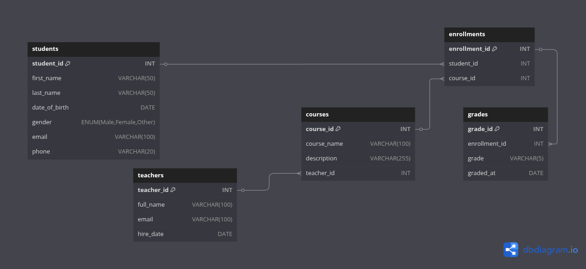

# School Database Management System + CRUD API with FastAPI

## Description

A simple School DBMS built using **FastAPI** and **MySQL**. It supports full **CRUD** operations for Students, Teachers, Courses, Enrollments, and Grades.

## Features

- Add, view, update, and delete students
- Assign teachers to courses
- Enroll students into courses
- Record grades for enrollments
- View relational data (e.g, who is enrolled in what, their grades, etc.)

## Tech stack

- Python (FastAPI)
- MySQL
- Pydantic for data validation
- Swagger UI for testing

## ERD screenshot


## Setup Instructions

### 1. Clone the repository
```bash
git clone https://github.com/darlene9497/School-DBMS-and-API.git
cd School-DBMS-and-API
```

### 2. Install dependencies
```bash
pip install -r requirements.txt
```

### 3. Set Up MySQL Database

Log in to MySQL:
```bash
mysql -u root -p
```

Create the database:
```sql
CREATE DATABASE school_db;
USE school_db;
```

Import the schema and sample data:
```sql
SOURCE sample_data.sql;
```

### 4. Run the FastAPI server
```bash
uvicorn main:app --reload
```

### 5. Test API in Swagger UI
Visit:
```text
http://127.0.0.1:8000/docs
```